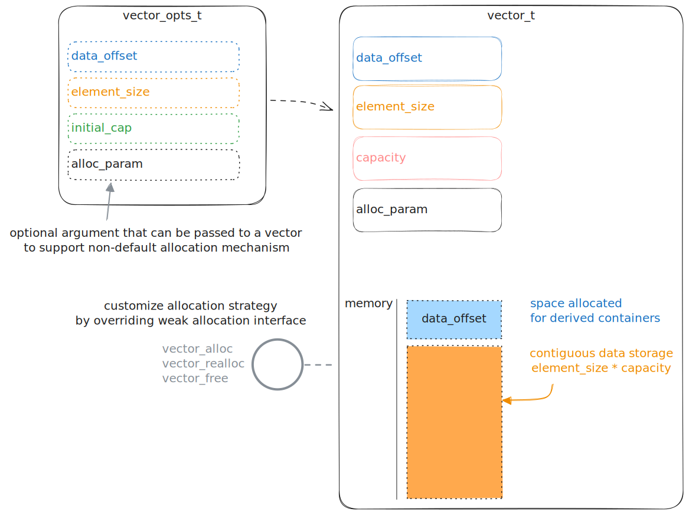

# Vector - extendable base for contiguous dynamic arrays.

Classic opaque type library. (`vector_t` impl is not exposed in headers)  
Contains a `vector_t` - base ADT for dynamic arrays.

The design allows for development of derived random access containers with ease.  
Provides api for array manipulations with extendability in mind.

## Implementation details

- Does not perform auto scaling and tracking of stored elements.  
  (all these functionalities have to be implemented in derived containers by design)

- Memory alignment is up to user.  
  Element of the vector are laid out one after another without padding.  
  You can add byte padding manually in struct of the element type.  
  Also you are able set `data_offset` to add padding between control struct and contents of the vector.  
  If you dislike how memory alignment is done, see next point.

- Default allocation strategy is a standard heap allocation, but can be altered.  
  You can use memalign instead of malloc for instance or custom allocator of your preference.

## Supported platforms

<div align="center">

| Platforms | CI/CD                                                                                       | COVERAGE                                                                                                                      |
| --------- | ------------------------------------------------------------------------------------------- | ----------------------------------------------------------------------------------------------------------------------------- |
| Linux     |      | [](https://codecov.io/github/evjeesm/vector)  |
| Windows   |  | [](https://codecov.io/github/evjeesm/vector) |

</div>

## Memory layout



## Dependencies

### Build System

- gcc
- make
- autotools:  
   automake >= 1.11.2  
   autoconf  
   autoconf-archive - install separately (for valgrind support)  
   libtool
- check - testing framework
- valgrind - for memory leak checks
- lcov - for code coverage analizing

### Libraries

- stdlib
- string
- stdbool
- [memswap](https://github.com/evjeesm/memory/blob/d7960a02c33ef956b9c915f3791fbdd6afdb0335/memswap.h)

## Build Process

- Install **Build System** dependencies:

  - On **Debian** / **Ubuntu**:
    - In your fav shell run:
      ```sh
      sudo apt-get install gcc make automake autoconf autoconf-archive libtool \
          check valgrind lcov
      ```
  - On **Windows**:
    - Install [msys2](https://www.msys2.org/) environment.
    - In msys2 shell run:
      ```msys2
      pacman -S curl git mingw-w64-ucrt-x86_64-gcc \
          mingw-264-ucrt-x86_64-check \
          autotools autoconf-archive lcov
      ```
      Set up git newline \n to \r\n convertion (windows style):
      ```msys2
      git config --global core.autocrlf input
      ```

- Clone the repository:
  ```sh
  git clone https://github.com/evjeesm/vector.git vector; cd vector;
  git submodule update --init --recursive;
  ```
- Configure project:
  ```sh
  ./autogen.sh && ./configure CFLAGS=<YOUR COMPILATION FLAGS> --prefix=</path/to/install/folder/>
  ```
- Build project: (use -j<threads> option for multithreaded building)
  ```sh
  make
  ```
- Run Tests:
  ```sh
  make check
  make check-valgrind    # optional memory check
  ```
- If no errors occured during _check_ you can safely install library  
  in your desired prefix path that you specified at configure step.  
  Procede to installation:
  ```sh
  make install
  ```

## Usage

Link against `libvector_static.a` or `libvector.so` on **linux**.  
If you on **Windows** platform link to `libvector_static.dll`.

### Minimal Example

```c
#include "vector.h"
int main(void)
{
    vector_t *vector = vector_create(.element_size = sizeof(int));
    int a = 69;
    vector_set(&vector, 0, &a);
    vector_set(&vector, 1, TMP_REF(int, 42));

    vector_get(vector, 1, &a); // a = 42
    vector_destroy(vector);
}
```
